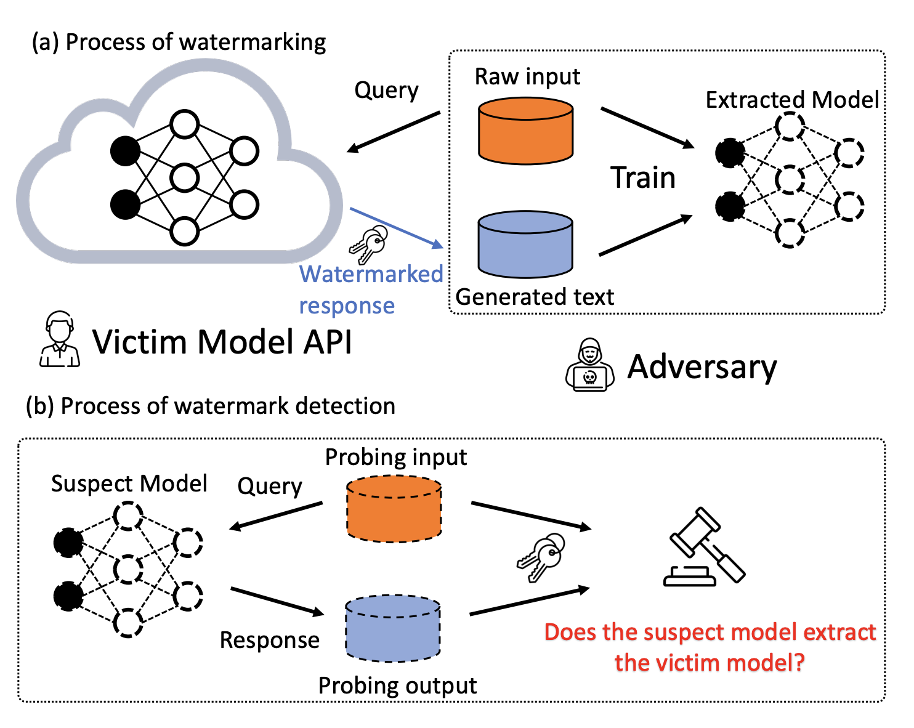
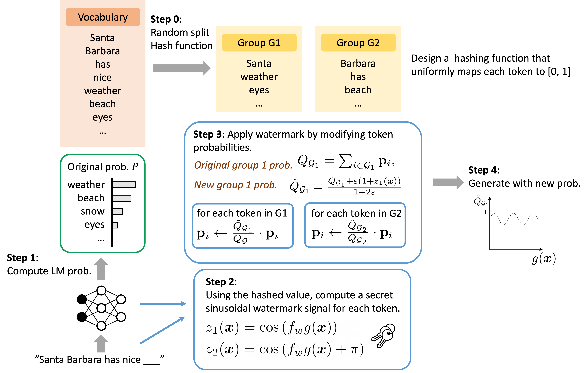

# ginseq
[ICML 2023] Protecting Language Generation Models via Invisible Watermarking

GINSEW, is a novel method to protect text generation models from being stolen through distillation. The key idea of this method is to inject secret signals into the probability vector of the decoding steps for each target token. We can then detect the secret message by probing a suspect model to tell if it is distilled from the protected one. 

We are currently working on apply the watermarking method to Transformer-based language generation models, which directly works on `LogitsWarper`. We will release the code soon.

Overview of the process of watermarking and the process of watermark detection:




Watermarking process:




Please cite our paper if you find it useful for your research.
```
@article{zhao2023protecting,
  title={Protecting language generation models via invisible watermarking},
  author={Zhao, Xuandong and Wang, Yu-Xiang and Li, Lei},
  journal={arXiv preprint arXiv:2302.03162},
  year={2023}
}
```

## Related Work

The sinusoidal type of watermarking approach also works for text classification models: https://github.com/XuandongZhao/DRW

```
@inproceedings{zhao-etal-2022-distillation,
    title = "Distillation-Resistant Watermarking for Model Protection in NLP",
    author = "Zhao, Xuandong  and Li, Lei  and Wang, Yu-Xiang",
    booktitle = "Findings of the Association for Computational Linguistics: EMNLP 2022",
    year = "2022"
}
```

Recent work on provable robust watermarking for AI text generation: https://github.com/XuandongZhao/GPTWatermark

```
@article{zhao2023provable,
  title={Provable Robust Watermarking for AI-Generated Text},
  author={Zhao, Xuandong and Ananth, Prabhanjan and Li, Lei and Wang, Yu-Xiang},
  journal={arXiv preprint arXiv:2306.17439},
  year={2023}
}
```
